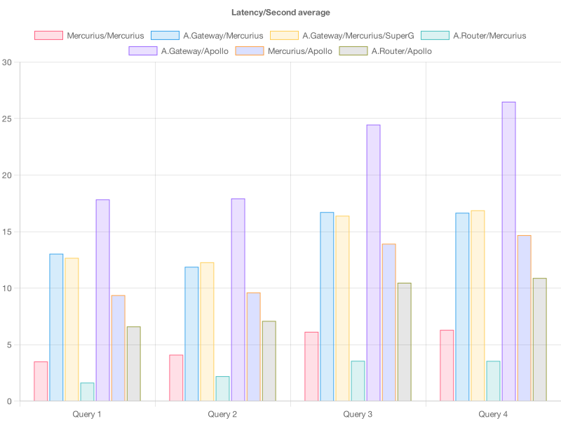
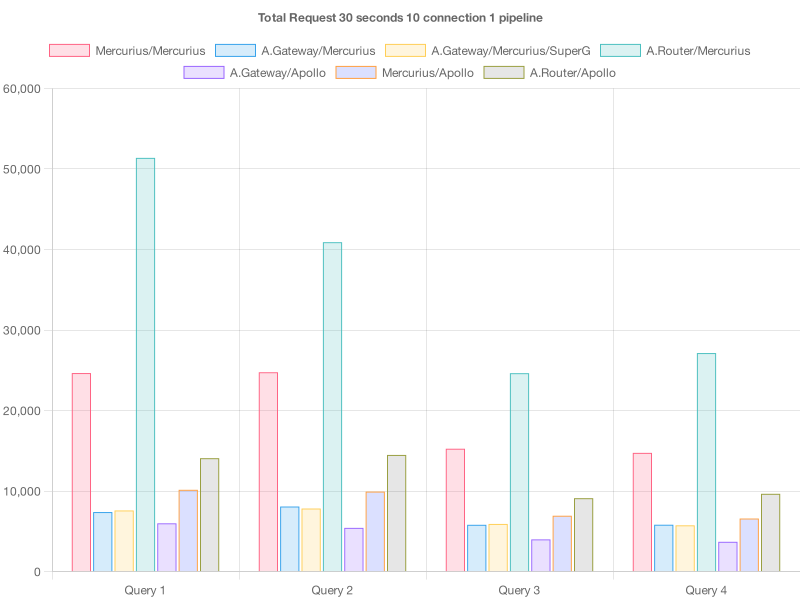

# Performance charts by query

The following charts groups the different queries used in the test.

 
## Queries


### Query 1
```
query {
  me {
    posts {
      title
    }
  }
}
```

### Query 2
```
query {
  users {
    id
    name
    addresses {
      id
      street
      city
      zip
    }
    posts {
      title
    }
  }
}
```

### Query 3
```
query {
  users {
    id
    name
    posts {
      title
      author {
        addresses {
          city
          zip
        }
      }
    }
  }
}
```

### Query 4
```
query {
  users {
    id
    name
    addresses {
      id
      street
      city
      zip
    }
    posts {
      title
      author {
        addresses {
          city
          zip
        }
      }
    }
  }
}
```


## Charts

### Latency Average



### Average requests per seconds


### Total requests


